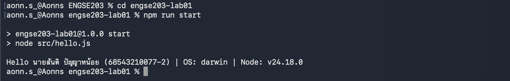
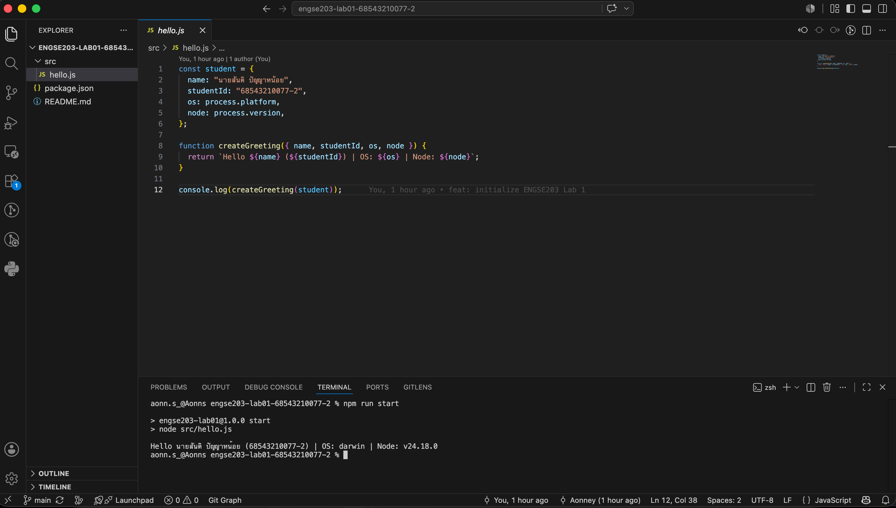

# ENGSE203 LAB 01 — Developer Environment & GitHub Repository Setup

## ผู้จัดทำ

- ชื่อ-นามสกุล: นายสันติ ปัญญาหน้อย
- รหัสนักศึกษา: 68543210077-2
- ระบบปฏิบัติการที่ใช้: macOS

## วัตถุประสงค์ของงาน

เมื่อทำ LAB นี้เสร็จ นักศึกษาจะสามารถ

- ตรวจสอบและใช้ Node.js, npm, Visual Studio Code และ Git จาก Terminal ได้
- สร้างโครงงาน JavaScript ขนาดย่อม พร้อม package.json และ npm script
- รันโปรแกรม Node.js ที่แสดงชื่อ รหัสนักศึกษา OS และ Node.js version ได้
- สร้าง GitHub repository, commit, push และจัดทำ README เพื่อเป็นหลักฐานการเรียนรู้ได้

## เครื่องมือที่ใช้

- Visual Studio Code
- Node.js รุ่น LTS และ npm
- Git
- บัญชี GitHub ที่ใช้งานได้
- อินเทอร์เน็ต

## วิธีติดตั้งและรัน
### ขั้นตอนที่ 1 — ตรวจสอบเครื่องมือ

เปิด **Visual Studio Code → Terminal → New Terminal** แล้วรันคำสั่งต่อไปนี้

```bash
node -v
npm -v
git --version
```

ผลลัพธ์ควรเป็นหมายเลขเวอร์ชันทั้ง 3 รายการ หากคำสั่งใดแสดงข้อความว่าไม่พบคำสั่ง ให้แจ้งผู้สอน/ผู้ช่วยสอนก่อนดำเนินการต่อ

### ขั้นตอนที่ 2 — สร้างโครงสร้างโครงงาน

สร้างพื้นที่ทำงานของรายวิชา แล้วสร้างโครงงาน LAB 1

**macOS / iMac M1**

```bash
mkdir -p ~/class/ENGSE203
cd ~/class/ENGSE203
```

**Windows 11 + Ubuntu WSL**

```bash
mkdir -p ~/class/ENGSE203
cd ~/class/ENGSE203
```

จากนั้น ใช้คำสั่งร่วมกันทั้งสองระบบ

```bash
mkdir engse203-lab01
cd engse203-lab01
npm init -y
mkdir src
code .
```
### ขั้นตอนที่ 3 — เขียนและรันโปรแกรม JavaScript

สร้างไฟล์ `src/hello.js` แล้วใส่โค้ดต่อไปนี้ โดยเปลี่ยนชื่อและรหัสนักศึกษาเป็นของตนเอง

```js
const student = {
  name: "ชื่อ-นามสกุล",
  studentId: "รหัสนักศึกษา",
  os: process.platform,
  node: process.version,
};

function createGreeting({ name, studentId, os, node }) {
  return `Hello ${name} (${studentId}) | OS: ${os} | Node: ${node}`;
}

console.log(createGreeting(student));
```

เปิดไฟล์ `package.json` และแก้ส่วน `scripts` ให้มีคำสั่ง `start`

```json
{
  "scripts": {
    "start": "node src/hello.js"
  }
}
```

จากนั้นรันโปรแกรม

```bash
npm run start
```

ผลลัพธ์ต้องแสดงชื่อ รหัสนักศึกษา ระบบปฏิบัติการ และ Node.js version ของเครื่องที่ใช้จริง

### ขั้นตอนที่ 4 — สร้าง GitHub Repository และ Push งาน

1. เปิด GitHub ผ่านเว็บเบราว์เซอร์
2. สร้าง repository ใหม่ชื่อ

```text
engse203-lab01-<student-id>
```

3. เลือกสร้าง repository ว่าง **ไม่ต้องสร้าง README จากหน้า GitHub**
4. กดปุ่ม **Code → SSH** แล้วคัดลอก SSH repository URL จาก GitHub จากนั้นรันคำสั่งด้านล่างภายในโฟลเดอร์ `engse203-lab01`

```bash
git config --global user.name "ชื่อภาษาอังกฤษของนักศึกษา"
git config --global user.email "อีเมลที่ใช้กับ GitHub"

git init
git add .
git commit -m "feat: initialize ENGSE203 Lab 1"
git branch -M main
git remote add origin git@github.com:<github-username>/engse203-lab01-<student-id>.git
git push -u origin main
```

หลัง push สำเร็จ ให้เปิดหน้า repository แล้วตรวจว่ามี `src/hello.js`, `package.json` และ `README.md` ครบถ้วน

## โครงสร้างไฟล์

```text
engse203-lab01/
├── src/
│   └── hello.js
├── package.json
└── README.md
```

## หลักฐานผลลัพธ์

```bash
$ npm run start

```




## ปัญหาที่พบและวิธีแก้ไข

- ปัญหา: คำสั่ง ```code .``` ไม่สามารถใช้งานได้
- วิธีแก้: เปิด Visual Studio Code แล้วติดตั้งคำสั่ง code ลงใน PATH ผ่าน Command Palette
  โดยเลือก ```Shell Command: Install 'code' command in PATH```

## References & AI Assistance

- Source / Documentation
  - คู่มือปฏิบัติการวิชา ENGSE203 สัปดาห์ที่ 1

- AI tool used
  - ChatGPT (OpenAI)
    
- Used for
  - ช่วยอธิบายขั้นตอนการสร้างโครงงาน Node.js
  - ช่วยอธิบายการใช้งาน Git และ GitHub
  - ช่วยตรวจสอบรูปแบบของ README และความถูกต้องของคำสั่ง

- My adaptation
  - สร้างโครงงาน เขียนโปรแกรม ทดสอบการทำงาน และ Push โค้ดขึ้น GitHub ด้วยตนเอง โดยใช้ ChatGPT เพื่อช่วยอธิบายขั้นตอน ตรวจสอบความถูกต้องของคำสั่ง และปรับปรุงการจัดรูปแบบเอกสารเท่านั้น
